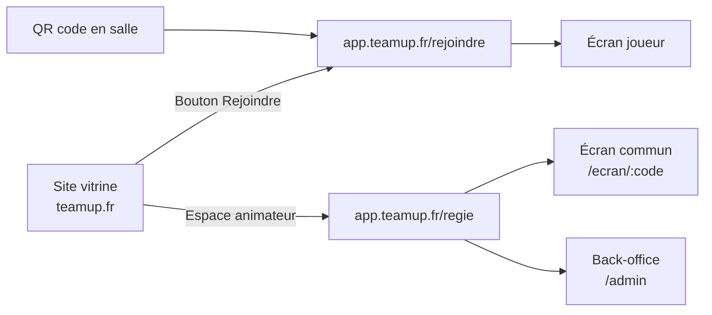

# Team Up! — Cahier des charges v1

Version du 19/09/2026

## 1. Contexte et objectifs

Team Up! est une prestation d'animation en salle : un animateur Team Up! fait jouer des invités répartis en équipes mélangées, pour qu'ils se rencontrent. Le produit numérique comprend deux parties : un site vitrine qui génère des demandes de devis, et une app qui fait tourner les sessions de jeu.

| Cible | Occasions | Ce que le client achète |
| --- | --- | --- |
| B2C | Anniversaire, mariage, anniversaire de mariage, fête de famille | Une soirée où les groupes d'invités se mélangent |
| B2B | Team building, séminaire, intégration | Un temps fort qui fait se parler des services qui ne se croisent pas |

**Modèle commercial.** Toutes les soirées sont animées par Team Up!. Le paiement se fait sur devis, hors site. Le site ne propose donc ni tunnel d'achat, ni paiement en ligne, ni compte client en libre-service.

**Objectifs du produit numérique :**

- Convertir un visiteur en demande de devis qualifiée.
- Permettre à un invité de rejoindre une partie en moins de 15 secondes, sans compte.
- Donner à l'animateur une régie fiable, utilisable en salle sombre et en situation de stress.
- Réutiliser le moteur de jeu de la spec v3 (cinq jeux socles et deux duels en bêta).

## 2. Acteurs et accès

Six profils utilisent le produit. Seuls l'animateur et l'admin ont un compte.

| Acteur | Où | Accès | Ce qu'il fait |
| --- | --- | --- | --- |
| Visiteur (prospect) | Site vitrine | Public | Découvre l'offre, demande un devis |
| Invité / joueur | App, écran joueur | Code de salle ou QR, sans compte | Rejoint son équipe, reçoit un secret, répond au quiz |
| Capitaine | App, écran joueur | Idem, avec un rôle attribué par la régie | Envoie les photos de son équipe |
| Animateur Team Up! | App, régie | Compte avec connexion | Prépare l'événement, pilote la soirée, saisit les scores |
| Écran commun | App, écran projeté | Lien d'événement ouvert depuis la régie | Affiche code, jeux, chronos, scores, podium |
| Admin Team Up! | App, back-office | Compte avec rôle admin | Gère les animateurs et les banques de contenus |

Le client (organisateur de la fête, RH, office manager) n'a pas d'accès à l'app en v1. Ses informations sont recueillies par le formulaire de devis puis par l'animateur.

## 3. Architecture et domaines

Recommandation : deux applications séparées, sur deux sous-domaines d'un même domaine. Le choix final reste ouvert (section 8).

La vitrine redirige vers l'app ; elle ne contient aucune logique de jeu.

**Pourquoi deux sous-domaines :**

- La vitrine a besoin de SEO, d'un contenu modifiable sans développeur et de pages légères.
- L'app a besoin d'un installable PWA, du temps réel et d'un déploiement indépendant. Le manifest actuel (`start_url` et `scope` à `/`) suppose déjà une app à la racine de son domaine.
- Une panne ou une mise à jour de la vitrine ne doit jamais toucher une soirée en cours.

**URL courtes.** Le code de salle doit pouvoir se taper à la main : `app.teamup.fr/K7P2M9` ouvre directement la bonne partie. Le QR code affiché sur l'écran commun pointe vers cette URL.

## 4. Site vitrine

Le site a un seul objectif de conversion : la demande de devis. Toutes les pages y mènent.

**En-tête (toutes les pages) :** logo horizontal, menu (Particuliers, Entreprises, Les jeux, Comment ça marche), bouton secondaire « Rejoindre une partie », bouton principal « Demander un devis ». Sur mobile, les deux boutons restent visibles hors du menu burger.

**Pied de page :** contact, réseaux sociaux, mentions légales, confidentialité, CGV, lien discret vers l'espace animateur.

| # | Page | Sections | Appel à l'action |
| --- | --- | --- | --- |
| 1 | Accueil | Accroche et baseline ; visuel du jeu (écran de salle + téléphone) ; deux portes (Particuliers / Entreprises) ; les jeux en aperçu ; déroulé en 3 étapes ; témoignages ; chiffres (soirées, invités) | Demander un devis |
| 2 | Particuliers | Occasions (anniversaire, mariage, fête de famille) ; bénéfice : mélanger les familles et les amis ; soirée multilingue ; exemples de programme ; FAQ | Devis pré-rempli « Particulier » |
| 3 | Entreprises | Formats (team building, séminaire, intégration) ; bénéfice : décloisonner les services ; formats 40 et 60 min ; références clients ; FAQ | Devis pré-rempli « Entreprise » |
| 4 | Les jeux | Une fiche par jeu socle : principe, durée, qui joue, visuel ; duels présentés en option | Demander un devis |
| 5 | Comment ça marche | Avant (devis, appel de cadrage, préparation) ; pendant (animateur, écran, téléphones) ; besoins techniques (vidéoprojecteur, sono, place au sol) ; nombre d'invités et d'équipes | Demander un devis |
| 6 | Demande de devis | Formulaire (détail ci-dessous) ; délai de réponse annoncé | Envoyer |
| 7 | Confirmation | Remerciement ; prochaines étapes ; délai de rappel | Retour à l'accueil |
| 8 | Rejoindre une partie | Champ code de salle (6 caractères) ; aide « où trouver le code » | Redirection vers l'app |
| 9 | Pages légales | Mentions légales, confidentialité, CGV, cookies | — |

**Formulaire de devis.** Champs requis : type (particulier / entreprise), occasion, date, ville ou lieu, nombre d'invités, nom, e-mail, téléphone. Champs facultatifs : société, durée du créneau disponible, nombre de groupes à mélanger, langues parlées, équipement de la salle, message libre. Ces champs alimentent directement le calcul du programme (nombre d'équipes et créneau, voir spec v3). La demande envoie un e-mail à Team Up! et un accusé de réception au prospect.

**Page 8.** Elle est un filet de sécurité : la plupart des invités arriveront par le QR code, directement dans l'app.

## 5. App de jeu

L'app a quatre surfaces : écran joueur (téléphone), écran commun (projection), régie (animateur) et back-office (admin). Le comportement des jeux suit la spec v3 ; cette section décrit les écrans.

### 5.1 Écran joueur (téléphone, thème clair)

Principe v3 : le téléphone est un instrument de régie. Il reste la plupart du temps sur un écran d'attente.

| Écran | Contenu |
| --- | --- |
| Rejoindre | Code pré-rempli par le QR ; saisie manuelle possible |
| Langue | FR / tamoul / EN (liste configurable par événement), mémorisée |
| Prénom | Un champ, pas de compte |
| Mon équipe | Nom et couleur d'équipe en plein écran, pour se retrouver dans la salle |
| Attente | Équipe, score, prochain jeu ; « Regarde l'écran » |
| Secret | Mot ou consigne pour un joueur désigné ; masqué par défaut, appui long pour voir |
| Quiz (mode téléphone) | Quatre boutons A/B/C/D, pleine largeur ; écran « Éliminé, tu passes spectateur » |
| Photo challenge | Accessible toute la soirée : liste des thèmes, état des envois de l'équipe ; bouton d'envoi pour le capitaine seulement ; état « envois clos » |
| Fin | Podium, remerciement, lien vers le site |
| Hors ligne | Bandeau de reconnexion ; la session reprend sans ressaisie |

### 5.2 Écran commun (projection, fond beige)

Lisible depuis le fond de salle : chronos et scores en 6 rem, aucun texte courant sous 2 rem, aucune interaction.

| Écran | Contenu |
| --- | --- |
| Accueil | Logo, QR code géant, code de salle, compteur de joueurs connectés |
| Équipes | Composition par couleur, compteurs |
| Programme | Les jeux de la soirée, jeu en cours surligné |
| Intro de jeu | Nom, règle en une phrase, pictogramme |
| Points communs | Consigne affichée puis masquée ; chrono ; paliers ; indices |
| Quiz | Question et quatre quadrants A/B/C/D alignés sur la croix au sol |
| Surenchère | Thèmes ; sujet dévoilé ; chrono géant qui vire au rouge à zéro |
| Mime | Écran neutre pendant la chaîne ; révélation vert / rouge |
| Duels | Noms des deux duellistes, chrono |
| Scores | Classement animé après chaque jeu |
| Diffusion photo | Un thème à la fois, photos côte à côte, gagnante mise en avant |
| Podium | Top 3 animé, logo, remerciements |

### 5.3 Régie (animateur, tablette ou ordinateur portable)

La régie pilote tout ce qui s'affiche. Elle doit être utilisable d'une main, en salle sombre.

| Écran | Contenu |
| --- | --- |
| Connexion | E-mail et mot de passe |
| Mes événements | Liste à venir / passés, création |
| Préparation | Infos client, langues, nombre et noms d'équipes, programme (jeux, ordre, nombre de passages) avec calcul de durée automatique face au créneau, choix des contenus dans les banques, thèmes photo |
| Répétition | Lancer l'événement en mode test, sans scores |
| Salle | Ouvrir l'écran commun, suivre les connexions, répartir les équipes, désigner les capitaines |
| Pilotage | Jeu en cours, grosses touches d'étape (afficher, masquer, lancer, indice, valider), chrono, saisie des résultats, aperçu de l'écran commun |
| Scores | Tableau, correction manuelle avec historique |
| Photos | Suivi des envois, clôture, choix de la gagnante par thème |
| Clôture | Podium, export des scores et des photos |

### 5.4 Back-office (admin Team Up!)

- Gestion des animateurs (création, désactivation).
- Banques de contenus par jeu, chaque entrée traduite dans toutes les langues actives : points communs (consigne, réponse, 2 indices), questions de quiz, couples thème / sujet de surenchère, mots de mime, thèmes photo.
- Étiquettes par contenu : B2C, B2B, tout public, pour filtrer au moment de la préparation.
- Historique des événements (date, client, nombre de joueurs, durée réelle vs prévue).

## 6. Principes de design

La vitrine et l'app partagent le kit de marque existant (`tokens.css`). Aucune couleur ni taille n'est codée en dur.

| Surface | Thème | Règles propres |
| --- | --- | --- |
| Site vitrine | Clair (crème #FAF7F2, texte navy) | Aucune photo d'événement : uniquement des visuels du jeu (écran commun, téléphones, régie), ton chaleureux |
| Écran joueur | Clair | Une action par écran ; cibles tactiles de 56 px minimum ; lisible en deux secondes |
| Écran commun | Fond beige du logo, texte navy (décision du 9 octobre 2026) | Aucun contrôle visible ; typo display 4 à 6 rem ; animations de révélation 600 ms |
| Régie | Stage, pour ne pas éblouir en salle | Grosses touches d'étape ; confirmation sur les actions irréversibles (valider un score, clore les photos) |

**Règles communes, reprises du kit :**

- Corail réservé à l'action (« c'est à toi », bouton d'envoi, devis) ; jamais en décor.
- Couleurs d'équipe : navy, corail, sauge, ambre ; au-delà de 4 équipes, il faut 4 couleurs supplémentaires à définir (la spec v3 va jusqu'à 8).
- Poppins pour les titres et chiffres, Inter pour le texte, Noto Sans Tamil pour le tamoul.
- `prefers-reduced-motion` respecté partout.

**Livrables design attendus :** maquettes mobile et desktop des 9 pages vitrine ; maquettes mobile des écrans joueur ; maquettes 16:9 de l'écran commun ; maquettes tablette de la régie ; bibliothèque de composants.

## 7. Exigences transverses

| Domaine | Exigence |
| --- | --- |
| Langues | App : langues configurables par événement (FR, EN, tamoul au lancement), chaque joueur choisit la sienne. Vitrine : FR au lancement, EN à décider |
| Capacité | 150 joueurs connectés par événement, mises à jour d'écran en moins d'1 s |
| Réseau | Chaque jeu se comporte comme décrit dans la spec v3 en cas de coupure ; reconnexion automatique sans perte de session ; photos envoyées en file d'attente et compressées côté téléphone |
| Compatibilité | Téléphones iOS et Android de moins de 5 ans, navigateur uniquement, aucune installation obligatoire |
| Performance vitrine | Page d'accueil chargée en moins de 2,5 s sur 4G |
| RGPD | Joueurs : prénom seul, aucune donnée de contact. Photos : durée de conservation et droit à l'image à préciser dans les CGV. Prospects : consentement au formulaire. Bandeau cookies si mesure d'audience |
| Accessibilité | Vitrine conforme RGAA niveau AA ; contrastes du kit vérifiés ; focus visible |
| Sécurité | Secrets (mot de mime, sujet de surenchère) jamais envoyés aux téléphones non désignés ; code de salle expiré après l'événement |
| Mesure | Vitrine : taux de conversion en devis. App : durée réelle par jeu, taux de connexion des invités |

## 8. Points à décider

- [ ] Domaine : sous-domaine séparé (recommandé) ou même domaine avec un chemin `/jouer` ?
- [ ] Espace client : le client doit-il pouvoir remplir lui-même ses infos d'avant soirée (listes d'invités, thèmes photo), ou l'animateur s'en charge-t-il ?
- [ ] Vitrine en anglais dès le lancement ?
- [ ] Tarifs affichés (« à partir de ») ou uniquement sur devis ?
- [x] Couleurs d'équipe 5 à 8 : prune, turquoise, olive, framboise (lot 3, dans `tokens.css`).
- [ ] Durée de conservation des photos et possibilité pour le client de les télécharger.
- [ ] Points ouverts de la spec v3 : repêchage du quiz, clôture des envois photo, longueur de la file de mime, composition des équipes.
